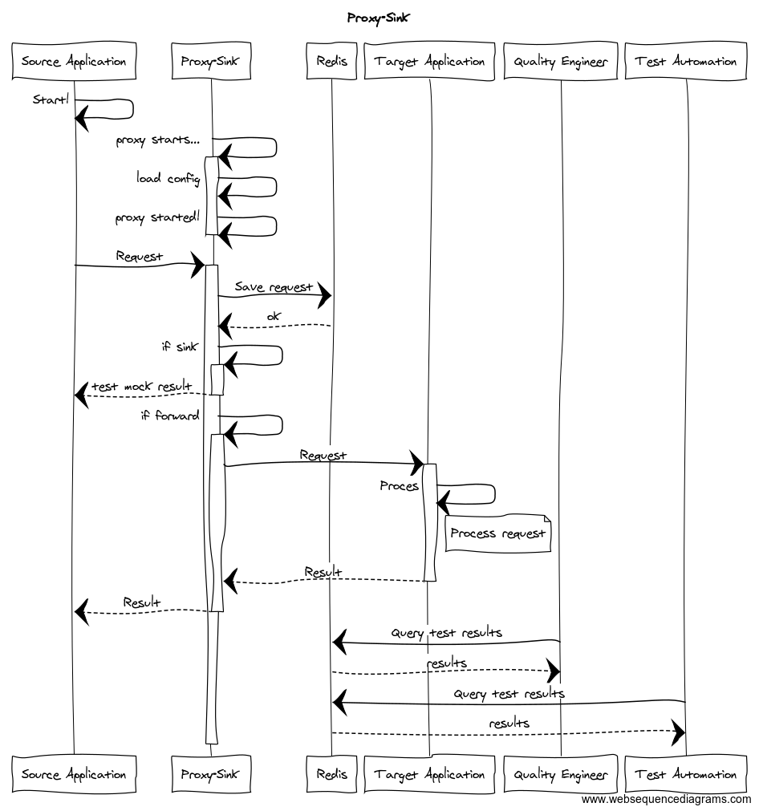

# proxy-sink
Reverse proxy with data sink on a Redis database.

Useful to test http endpoints.



Diagram produed at https://www.websequencediagrams.com/ - code: 
```
title Proxy-Sink

Source Application->Source Application: Start!

Proxy-Sink->+Proxy-Sink: proxy starts...
Proxy-Sink->Proxy-Sink: load config
Proxy-Sink->-Proxy-Sink: proxy started!

Source Application->+Proxy-Sink: Request
Proxy-Sink->Redis: Save request
Redis-->Proxy-Sink : ok
Proxy-Sink->+Proxy-Sink: if sink
Proxy-Sink-->-Source Application: test mock result
Proxy-Sink->+Proxy-Sink: if forward
Proxy-Sink->+Target Application: Request

Target Application-> Target Application: Proces
note right of Target Application
    Process request
end note

Target Application-->-Proxy-Sink: Result

Proxy-Sink-->-Source Application: Result


Quality Engineer->Redis: Query test results
Redis-->Quality Engineer:  results


 
Test Automation->Redis: Query test results
Redis-->Test Automation:  results

```